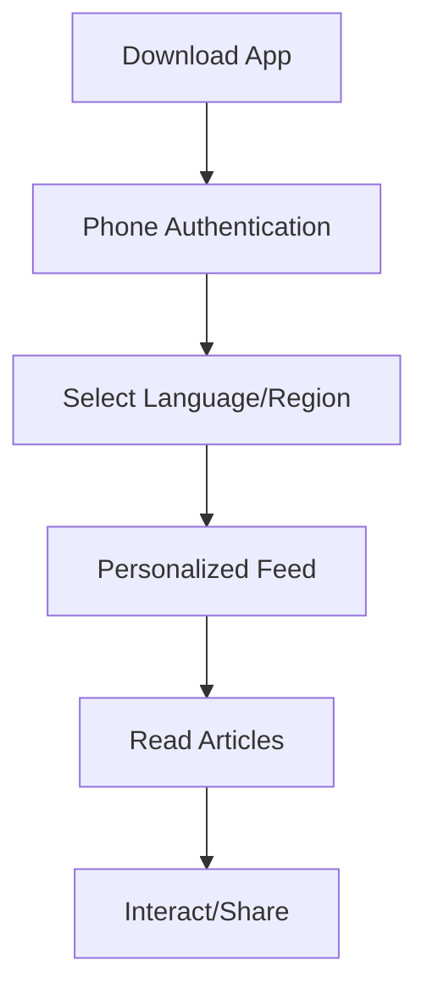
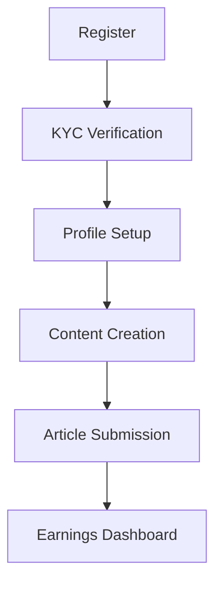

# Glocal News Technical Documentation

## Overview
Glocal News is a comprehensive hyperlocal news platform available on web, Android, and iOS, supporting multiple Indian languages and offering various revenue streams.

## Technology Stack

### Frontend
- Web: React + TypeScript + Vite
- Mobile: NativeScript (iOS/Android)
- UI Framework: Tailwind CSS
- State Management: React Context API
- Internationalization: i18next

### Backend
- Firebase Services
  - Authentication
  - Firestore (Database)
  - Storage
  - Analytics
  - Cloud Functions

### Key Dependencies
```json
{
  "dependencies": {
    "@nativescript/core": "~8.8.0",
    "@headlessui/react": "^1.7.17",
    "@heroicons/react": "^2.0.18",
    "firebase": "^10.6.0",
    "i18next": "^23.7.6",
    "react": "^18.2.0",
    "react-dom": "^18.2.0",
    "react-router-dom": "^6.20.0",
    "chart.js": "^4.4.0",
    "tailwindcss": "^3.3.5"
  }
}
```

## Core Features

### 1. Multi-language Support
- 8+ Indian languages
- Real-time language switching
- Content localization
- UI/UX adaptation for different scripts

### 2. Location-based News
- Hyperlocal targeting
- Location hierarchy:
  - State
  - District
  - Mandal
  - Village
- Geofencing for news delivery

### 3. Content Management
- Article creation and editing
- Media management (images/videos)
- Category management
- Tags and metadata
- Content scheduling

### 4. User Management
- Phone-based authentication
- Role-based access control:
  - Readers
  - Journalists
  - Admins
- User preferences
- Reading history

## User Journeys

### 1. Reader Journey


### 2. Journalist Journey


## Revenue Models

### 1. Advertising
- Banner ads
- Native ads
- Video ads
- Sponsored content
- Integration: Google AdMob, Meta Audience Network

### 2. Subscription Model
- Premium content access
- Ad-free experience
- Early access to stories
- Integration: Stripe, Razorpay

### 3. Journalist Revenue Share
- Pay per view
- Engagement bonuses
- Viral content rewards
- Payment methods:
  - UPI
  - Bank transfer
  - Digital wallets

### 4. Classifieds & Job Portal
- Paid listings
- Featured positions
- Premium visibility
- Integration: Payment gateways

## Payment Integration

### Supported Payment Methods
1. UPI
2. Credit/Debit Cards
3. Net Banking
4. Digital Wallets
5. International Cards

### Payment Gateway Integration
```typescript
interface PaymentConfig {
  gateway: 'razorpay' | 'stripe';
  mode: 'test' | 'production';
  credentials: {
    apiKey: string;
    apiSecret: string;
  };
}

interface PaymentProcessor {
  initializePayment(amount: number, currency: string): Promise<string>;
  verifyPayment(paymentId: string): Promise<boolean>;
  processRefund(paymentId: string): Promise<boolean>;
}
```

## Security Measures

### Data Protection
- End-to-end encryption
- Secure file storage
- Data backup
- GDPR compliance

### Authentication
- Phone verification
- JWT tokens
- Session management
- Role-based access

## Analytics & Reporting

### User Analytics
- Engagement metrics
- Reading patterns
- Language preferences
- Geographic distribution

### Content Analytics
- Article performance
- Category trends
- Author performance
- Revenue analytics

## Mobile App Features

### Android & iOS
- Push notifications
- Offline reading
- Share functionality
- Deep linking
- Social media integration

## Admin Panel Features

### Content Management
- Article approval
- User management
- KYC verification
- Payment processing
- Analytics dashboard

## Database Schema

### Collections
```typescript
interface Collections {
  users: User[];
  articles: Article[];
  comments: Comment[];
  payments: Payment[];
  analytics: Analytics[];
  advertisements: Advertisement[];
}
```

## API Integration

### External Services
1. Firebase Services
2. Payment Gateways
3. Social Media APIs
4. Analytics Services
5. Push Notification Services

## Deployment

### Web
- Hosting: Firebase Hosting
- CDN: Cloudflare
- SSL: Let's Encrypt

### Mobile
- Android: Google Play Store
- iOS: App Store
- CI/CD: Fastlane

## Performance Optimization

### Web
- Code splitting
- Lazy loading
- Image optimization
- Caching strategies

### Mobile
- Offline support
- Image caching
- Network optimization
- Memory management

## Testing Strategy

### Types
1. Unit Testing
2. Integration Testing
3. E2E Testing
4. Performance Testing
5. Security Testing

## Monitoring & Logging

### Tools
1. Firebase Analytics
2. Error tracking
3. Performance monitoring
4. User behavior tracking

## Future Enhancements

1. AI-powered content recommendations
2. Voice news
3. AR/VR news experience
4. Blockchain integration for content verification
5. Advanced analytics dashboard

## Technical Support

### Support Channels
1. In-app support
2. Email support
3. Phone support
4. Documentation
5. FAQ section